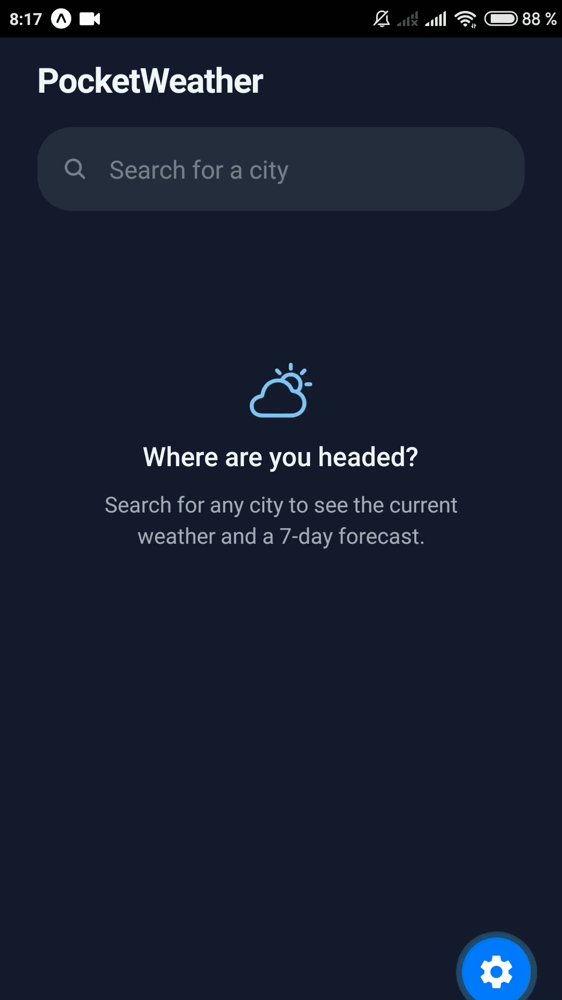

# PocketWeather 🌦

A weather app in React Native + Expo. Search a city, get current conditions and a 7-day forecast. Uses Open-Meteo, which doesn't require an API key.

Runs in Expo Go on iOS and Android.



## Features

- City search through the Open-Meteo geocoding API, with a picker when several cities match the name
- Current weather: temperature, feels-like, wind, and a condition derived from WMO weather codes
- 7-day forecast with min/max temperatures and icons
- The whole screen state is one discriminated union (`idle / searching / cities / loadingForecast / ready / error / noResults`) instead of a pile of booleans
- Background tint follows the current weather
- The API layer in `src/api` has no React in it and would work in a web client as is

## Stack

React Native, Expo, TypeScript, Open-Meteo REST API

## Run it

```bash
npm install
npx expo start
```

Scan the QR code with the Expo Go app, or press `w` for the web version.

Web build for deployment:

```bash
npx expo export --platform web   # outputs to dist/
```

## What I learned

One `Phase` union instead of separate `isLoading` / `hasError` flags removed a whole class of bugs: the compiler simply won't let the forecast render unless a city and data both exist. I also hit a real race condition here. Two searches fired quickly, the slow one resolved last and overwrote the newer result. Fixed it with a request sequence counter and covered it with a test. And `StyleSheet` felt surprisingly familiar, most CSS habits carry over through flexbox.
